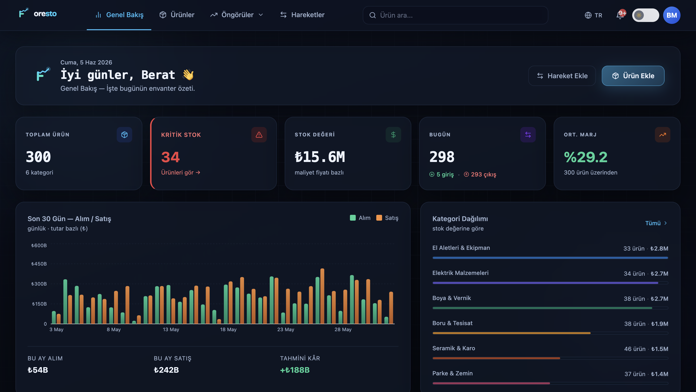
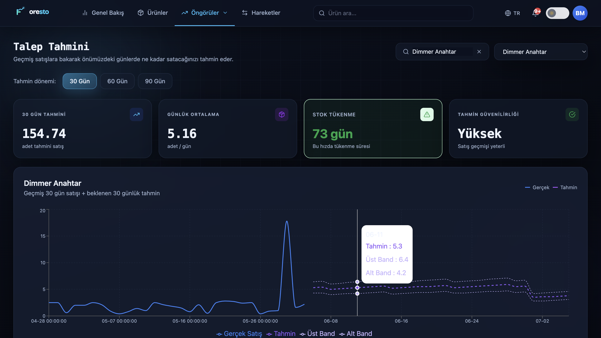
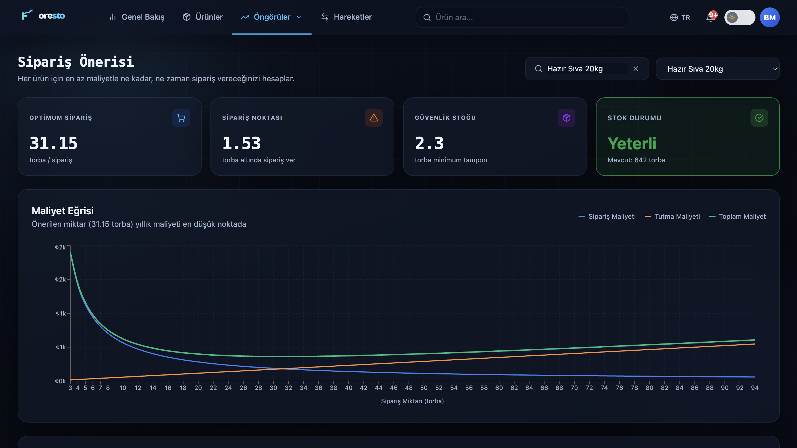
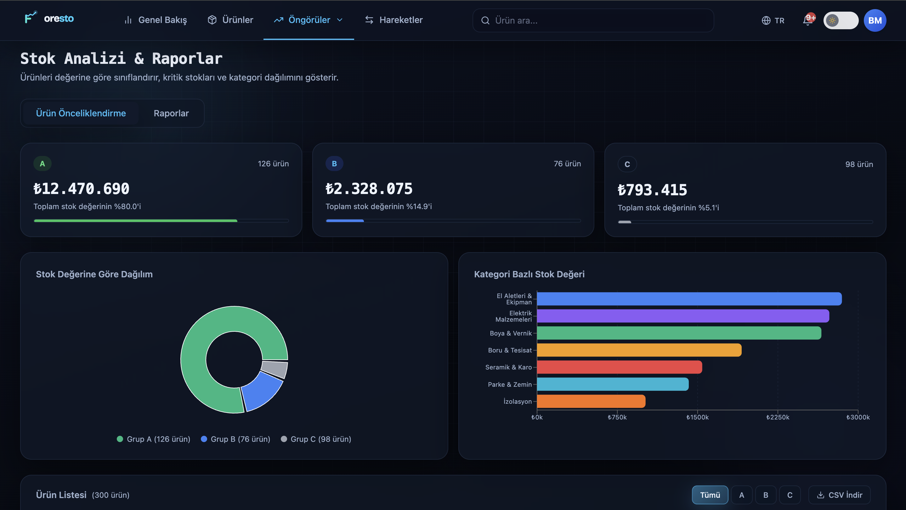
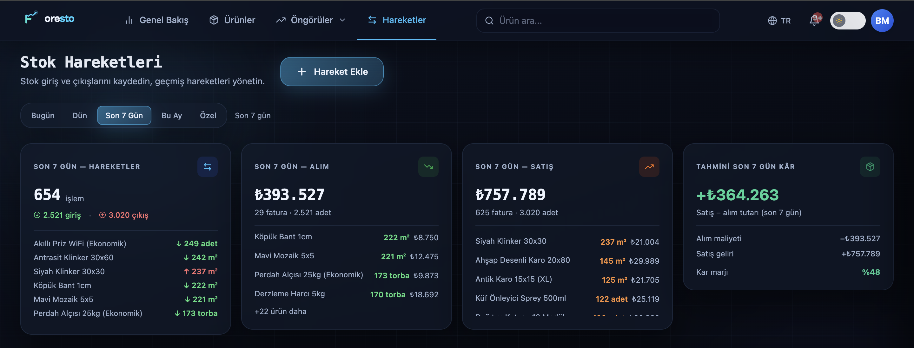
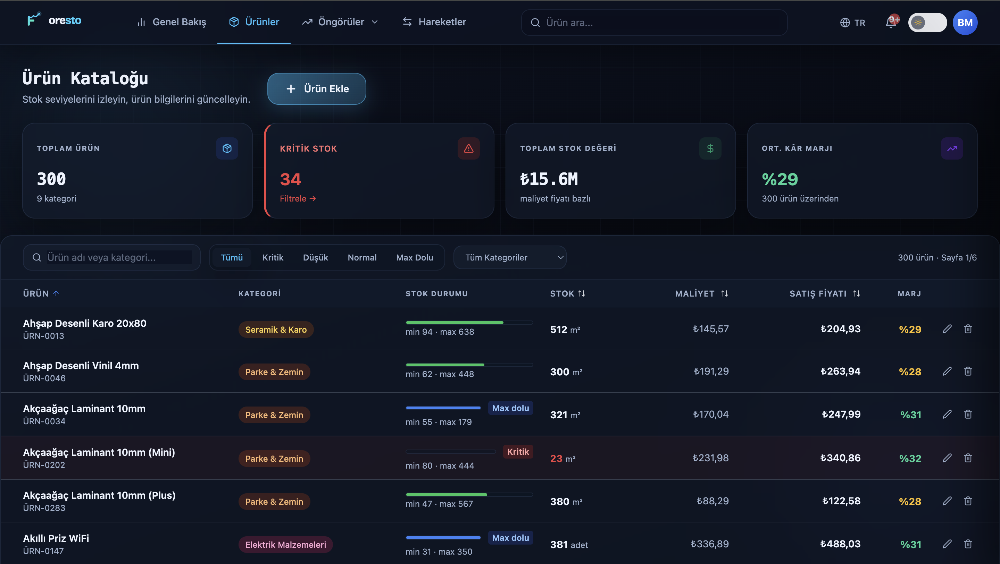

# Foresto

**Akıllı Envanter Yönetimi** — Makine öğrenmesi destekli talep tahmini ve sipariş optimizasyonuyla stok yönetimi platformu.

**Canlı Demo:** [foresto-mocha.vercel.app](https://foresto-mocha.vercel.app)

## Genel Bakış

Foresto, işletmelerin envanterini, stok durumlarını geleneksel yöntemlerden uzaklaşarak veriyle yönetmesini sağlayan tam yığın bir web uygulamasıdır. Geçmiş stok hareketlerinden talebi tahmin eder, maliyet-optimal sipariş miktarını hesaplar, ürünleri ciro katkısına göre önceliklendirir ve kritik stok seviyelerinde uyarı verir.

## Foresto Özellikleri

| Özellik | Açıklama |
|---|---|
| **Talep Tahmini** | Ridge Regression ile geçmiş satış verisinden ileriye dönük talep öngörüsü |
| **Sipariş Önerisi** | EOQ (Economic Order Quantity) modeliyle sipariş ve tutma maliyetini dengeleyen optimal sipariş miktarı |
| **Ürün Önceliklendirme** | ABC analizi ile ürünleri ciro katkısına göre A/B/C sınıflarına ayırma (Pareto prensibi) |
| **Stok Hareketleri** | Giriş/çıkış kayıtları, otomatik stok güncelleme, yetersiz stok kontrolü |
| **Genel Bakış Paneli** | Toplam ürün, kritik stok adedi, toplam stok değeri ve ortalama kâr marjı gibi anlık analizler |
| **Kritik Stok Uyarıları** | Yeniden sipariş eşiğinin altına düşen ürünlerin otomatik tespiti |

## Ekran Görüntüleri

<table>
  <tr>
    <td width="50%"><b>Genel Bakış</b> </td>
    <td width="50%"><b>Talep Tahmini</b> </td>
  </tr>
  <tr>
    <td width="50%"><b>Sipariş Önerisi (EOQ)</b> </td>
    <td width="50%"><b>Ürün Önceliklendirme (ABC)</b> </td>
  </tr>
  <tr>
    <td width="50%"><b>Stok Hareketleri</b> </td>
    <td width="50%"><b>Ürün Kataloğu</b> </td>
  </tr>
</table>

