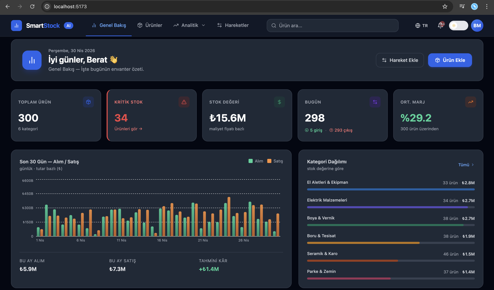
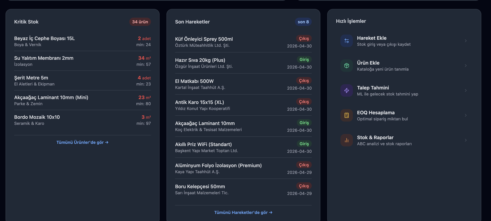
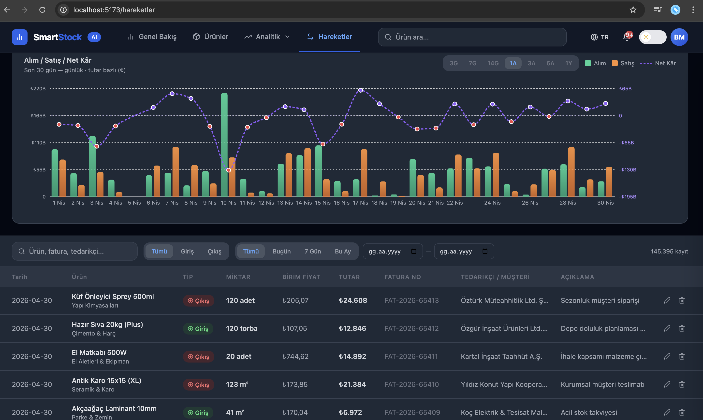
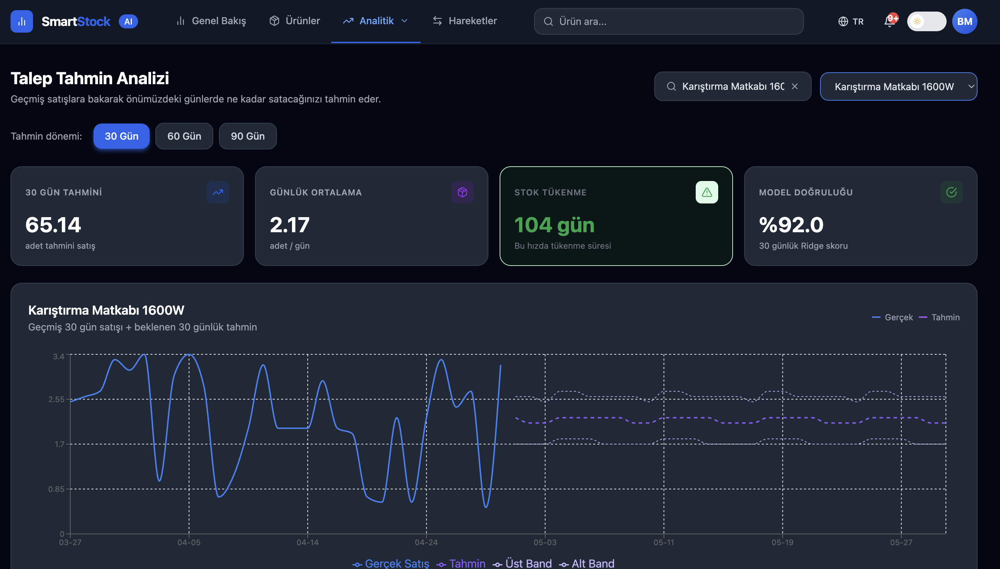
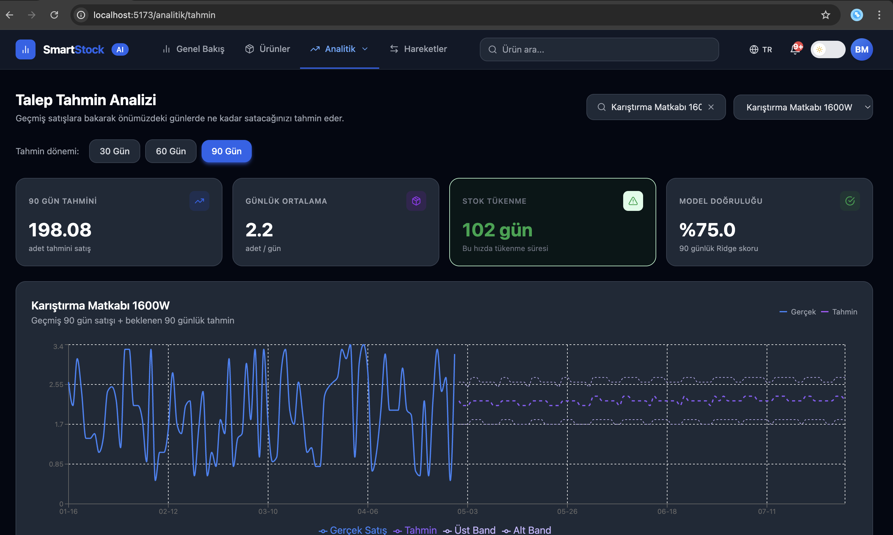
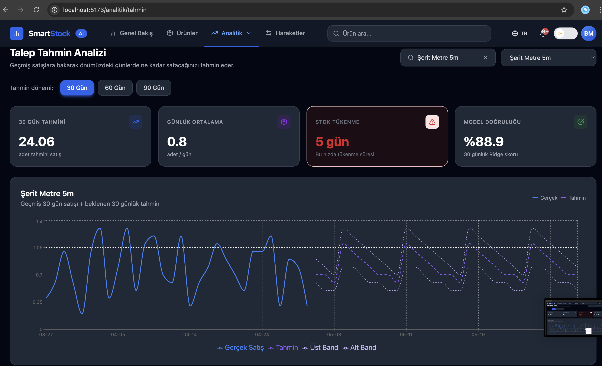
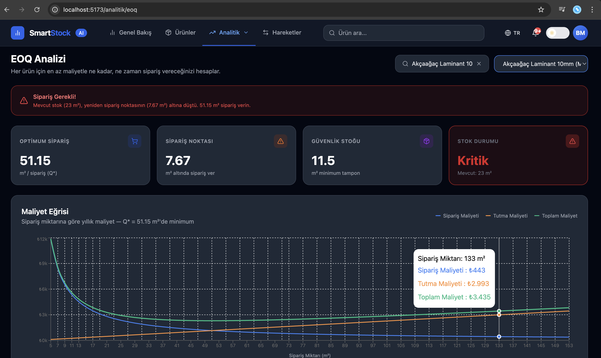
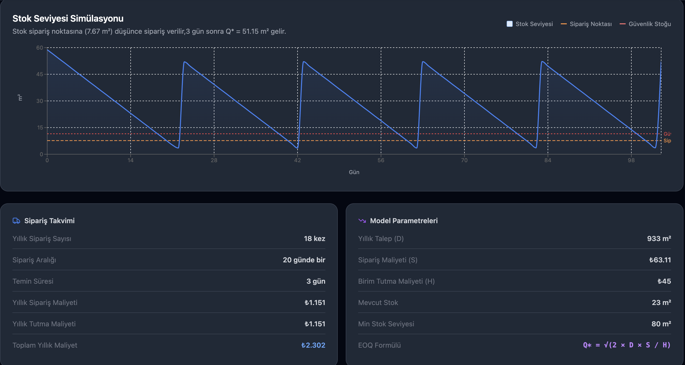
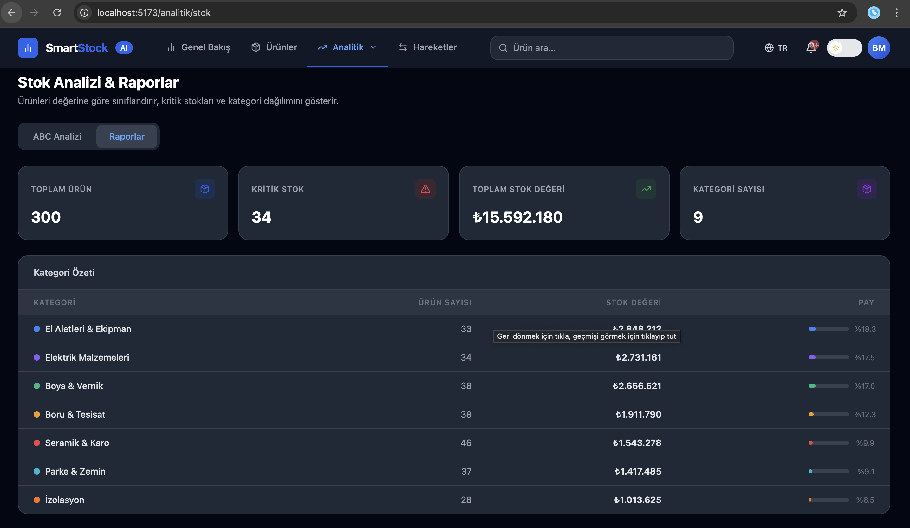
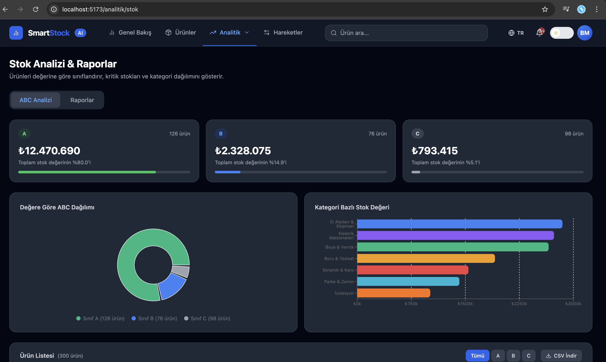

# SmartStock

**Full-stack inventory management system with ML-powered demand forecasting and EOQ optimization**

---

## Screenshots

### Login & Landing

### Dashboard

### Stok Hareketleri
| Genel Görünüm | Filtrelenmiş |
|---|---|
|  |  |

### Ürünler

### Talep Tahmini (Ridge Regression)
| 30 Gün | 90 Gün |
|---|---|
|  |  |

### EOQ Analizi
| Hesaplama | Grafik |
|---|---|
|  |  |

### Stok Raporları & ABC Analizi
| Rapor | ABC Sınıflandırma |
|---|---|
|  |  |

---

## Features

**Stok Yönetimi**
- Ürün kataloğu — kategori, birim, maliyet/satış fiyatı
- Gerçek zamanlı stok takibi, kritik stok uyarıları
- Stok hareket kaydı (giriş/çıkış) — tedarikçi, müşteri, fatura no
- Dönem bazlı KPI kartları ve Alım/Satış/Net Kâr grafiği

**Analitik & ML**
- **Talep Tahmini** — Ridge Regression; 7/30 günlük hareketli ortalama, haftanın günü özellikleri. 30/60/90 günlük tahmin + güven bandı.
- **EOQ Optimizasyonu** — Wilson formülü ile optimal sipariş miktarı; tutma ve sipariş maliyeti dengesi.
- **ABC Analizi** — Stok değerine göre A/B/C sınıflandırması.
- **Dashboard** — 30 günlük grafik, toplam ürün/kritik stok/stok değeri/ortalama kâr marjı.

---

